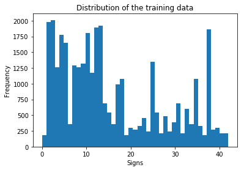
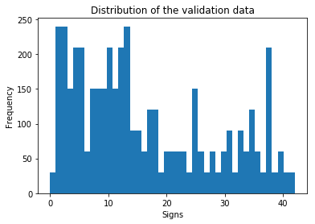
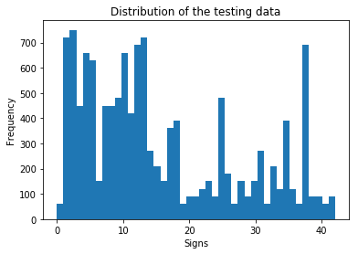
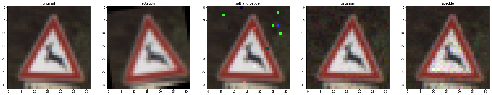
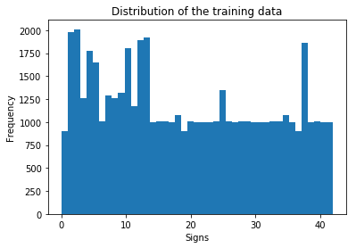

# **Traffic Sign Recognition** 

## Writeup

### You can use this file as a template for your writeup if you want to submit it as a markdown file, but feel free to use some other method and submit a pdf if you prefer.

---

**Build a Traffic Sign Recognition Project**

The goals / steps of this project are the following:
* Load the data set (see below for links to the project data set)
* Explore, summarize and visualize the data set
* Design, train and test a model architecture
* Use the model to make predictions on new images
* Analyze the softmax probabilities of the new images
* Summarize the results with a written report

[//]: # (Image References)

[image1]: ../examples/visualization.jpg "Visualization"
[image2]: ../examples/grayscale.jpg "Grayscaling"
[image3]: ../examples/random_noise.jpg "Random Noise"
[image4]: ../examples/placeholder.png "Traffic Sign 1"
[image5]: ../examples/placeholder.png "Traffic Sign 2"
[image6]: ../bexamples/placeholder.png "Traffic Sign 3"
[image7]: ../examples/placeholder.png "Traffic Sign 4"
[image8]: ../examples/placeholder.png "Traffic Sign 5"

## Rubric Points
### Here I will consider the [rubric points](https://review.udacity.com/#!/rubrics/481/view) individually and describe how I addressed each point in my implementation.  

---
### Writeup / README

#### 1. Provide a Writeup / README that includes all the rubric points and how you addressed each one. You can submit your writeup as markdown or pdf. You can use this template as a guide for writing the report. The submission includes the project code.

You're reading it! and here is a link to my [project code](https://github.com/david89/self-driving-car-traffic-sign-classifier/blob/master/notebook.ipynb)

### Data Set Summary & Exploration

#### 1. Provide a basic summary of the data set. In the code, the analysis should be done using python, numpy and/or pandas methods rather than hardcoding results manually.

I used simple Python methods to calculate summary statistics of the traffic signs data set like:

* The size of training set is 34799
* The size of the validation set is 4410
* The size of test set is 12630
* The shape of a traffic sign image is (32, 32, 3)
* The number of unique classes/labels in the data set is 43

#### 2. Include an exploratory visualization of the dataset.

Here is an exploratory visualization of the data set. It is a bar chart showing how the data ...

As you can see, the distribution of the training, validation and testing sets are similar. However, it's worth noticing that some labels don't contain a high number of samples. For example, the label 0 only contains 180 samples in the training set, while others contain magnitudes more. Therefore, we may need to collect or generate more data if we a model that will be able to classify those labels with low frequency, with enough precision.

### Design and Test a Model Architecture

#### 1. Describe how you preprocessed the image data. What techniques were chosen and why did you choose these techniques? Consider including images showing the output of each preprocessing technique. Pre-processing refers to techniques such as converting to grayscale, normalization, etc. (OPTIONAL: As described in the "Stand Out Suggestions" part of the rubric, if you generated additional data for training, describe why you decided to generate additional data, how you generated the data, and provide example images of the additional data. Then describe the characteristics of the augmented training set like number of images in the set, number of images for each class, etc.)

First of all, we decided to consider images in the RGB color space, since we don't know if color might bring extra information to our prediction model.

In the "Data Set Summary & Exploration" section we mentioned that we don't have enough samples for certain labels. One possible workaround is to generate some synthetic data for such labels. For example, we could apply the following transformations.

* We could rotate the image by a small angle (between -10 and 10 degrees for example).

* Salt and pepper; where we set some random pixels to either 0 (black or "pepper") or 255 (white or "salt"). Please note that in a RGB image, salt and pepper may not set the pixels to black or white, but something like bright green, red or blue.

* Gaussian; as described in [here](https://en.wikipedia.org/wiki/Gaussian_noise).

* Speckle noise.

The following image contains a sample image and the different transformations we could apply over it:

After applying different noise functions to our dataset, we have a much better distribution:

However, we are not going to use the new extended train data set just yet, because we want to measure the accuracy of the model on the initial test data set.

In order to smooth out the data, we decided to use the formula (pixel - 128) / 128, which will transform pixels in the [0, 255] range into the [-1.0, 1.0] range. Smaller ranges will allow our model to converge faster and give more accurate predictions. As a future improvement for this project, we could use a standardization feature scalling, i.e., (x - mean(x)) / stddev(x).

Finally, we shuffled our data to make sure the model doesn't depend on the ordering of the samples.

#### 2. Describe what your final model architecture looks like including model type, layers, layer sizes, connectivity, etc.) Consider including a diagram and/or table describing the final model.

The architecture that we used is described in the [Yann LeCun paper](./lecun_paper.pdf). More specifically, this is the architecture that we used:

Now, let's go through each layer of the chose architecture:

| Layer         		|     Description	        					| 
|:---------------------:|:---------------------------------------------:| 
| L0.1: Input         		| 32x32x3 RGB image   							| 
| L1.1: Convolution 5x5 over L0.1    	| 1x1 stride, valid padding, outputs 28x28x6 	|
| L1.2: Activation (RELU or TANH) over L1.1					|	outputs 28x28x6											|
| L1.3: Max pooling	over L1.2      	| 2x2 stride,  outputs 14x14x6 |
| L2.1: Convolution 5x5 over L1.3    	| 1x1 stride, valid padding, outputs 10x10x16 |
| L2.2: Activation (RELU or TANH)	over L2.1				|	outputs 10x10x16 |
| L3.1: Pooling over L2.2     	| 2x2 stride, outputs 5x5x16 |
| L3.2: Convolution 5x5 over L3.1					|	1x1 stride, valid padding, outputs 1x1x400											|
| L3.3: Concatenation of flattened L2.2 and L3.2	      	| outputs 2000 |
| L3.4: Dropout over L3.3	      	| outputs 2000 |
| L4.1: Fully connected	over L3.4	| outputs `n_classes` |
 
#### 3. Describe how you trained your model. The discussion can include the type of optimizer, the batch size, number of epochs and any hyperparameters such as learning rate.

To train the model, I used the following steps:
* I transformed the labels tensor into a one hot encoding tensor, since we have a categorization problem.
* I got the logits tensor and a regularization tensor (based on the weights of each layer) from the chosen architecture.
* We then applied the softmax_cross_entropy_with_logits function over the one hot encoding and the logits from the architecture.
* Our loss function tries to reduce the mean of the cross entropy (from the previous step) + the regularization tensor * regularization rate.
* For the optimizer, we used the AdamOptimizer which is commonly used for this kind of problems.
* Additionally, we trained our model using batches, since feeding the whole data set at once was too expensive.

There are different hyperparameters involved in the aforementioned steps, however, we trained different models with different parameters, which will be discussed in the following section.

#### 4. Describe the approach taken for finding a solution and getting the validation set accuracy to be at least 0.93. Include in the discussion the results on the training, validation and test sets and where in the code these were calculated. Your approach may have been an iterative process, in which case, outline the steps you took to get to the final solution and why you chose those steps. Perhaps your solution involved an already well known implementation or architecture. In this case, discuss why you think the architecture is suitable for the current problem.

First of all, we trained a model with some default parameters:
* Activation function: RELU
* Number of epochs: 10
* Batch size: 128
* Learning rate: 0.001
* Regularization rate: 0.0
* Dropout rate: 0.5

With that model, we achieved 93.5% accuracy on the validation data set and 92.6% accuracy on the test data set. Meaning that the default values are not bad, but not good enough for 93% minimum accuracy. Therefore we decided to train different models and see which one performs better:

##### TANH activation function

* Activation function: TANH
* Number of epochs: 10
* Batch size: 128
* Learning rate: 0.001
* Regularization rate: 0.0
* Dropout rate: 0.5

Test accuracy: 92.3%

Since the RELU and TANH models gave us similar results, we decided to stick with the RELU activation function.

##### 30 epochs and 0.01 regularization rate

* Activation function: RELU
* Number of epochs: 30
* Batch size: 128
* Learning rate: 0.001
* Regularization rate: 0.01
* Dropout rate: 0.5

Test accuracy: 89.9%

Seems like the regularization rate is too high, so let's train another model with a more conservative value.

##### 30 epochs and 0.001 regularization rate

* Activation function: RELU
* Number of epochs: 30
* Batch size: 128
* Learning rate: 0.001
* Regularization rate: 0.001
* Dropout rate: 0.5

Test accuracy: 93.8% (**success**)

##### 0.01 learning rate

* Activation function: RELU
* Number of epochs: 10
* Batch size: 128
* Learning rate: 0.01
* Regularization rate: 0.0
* Dropout rate: 0.5

Test accuracy: 90.1%

Increasing the learning rate is definitely decreasing our accuracy.

##### 40 epochs and 0.0005 regularization rate

* Activation function: RELU
* Number of epochs: 40
* Batch size: 128
* Learning rate: 0.01
* Regularization rate: 0.0005
* Dropout rate: 0.5

Test accuracy: 93.95% (**success**)

##### 30 epochs

* Activation function: RELU
* Number of epochs: 30
* Batch size: 128
* Learning rate: 0.01
* Regularization rate: 0.0
* Dropout rate: 0.5

Test accuracy: 93.6% (**success**)

As you can see, the architecture proposed by LeCun gave us some good results (enough to get at least 93% success rate on the test set). The best model in our case is the one with 40 epochs and a regularization rate of 0.0005%, which has a test accuracy of ~94%. That's the model we are going to use in order to run our predictions.

### Test a Model on New Images

#### 1. Choose five German traffic signs found on the web and provide them in the report. For each image, discuss what quality or qualities might be difficult to classify.

Here are five German traffic signs that I found on the web:

![alt text][image4] ![alt text][image5] ![alt text][image6] 
![alt text][image7] ![alt text][image8]

The first image might be difficult to classify because ...

#### 2. Discuss the model's predictions on these new traffic signs and compare the results to predicting on the test set. At a minimum, discuss what the predictions were, the accuracy on these new predictions, and compare the accuracy to the accuracy on the test set (OPTIONAL: Discuss the results in more detail as described in the "Stand Out Suggestions" part of the rubric).

Here are the results of the prediction:

| Image			        |     Prediction	        					| 
|:---------------------:|:---------------------------------------------:| 
| Stop Sign      		| Stop sign   									| 
| U-turn     			| U-turn 										|
| Yield					| Yield											|
| 100 km/h	      		| Bumpy Road					 				|
| Slippery Road			| Slippery Road      							|

The model was able to correctly guess 4 of the 5 traffic signs, which gives an accuracy of 80%. This compares favorably to the accuracy on the test set of ...

#### 3. Describe how certain the model is when predicting on each of the five new images by looking at the softmax probabilities for each prediction. Provide the top 5 softmax probabilities for each image along with the sign type of each probability. (OPTIONAL: as described in the "Stand Out Suggestions" part of the rubric, visualizations can also be provided such as bar charts)

The code for making predictions on my final model is located in the 11th cell of the Ipython notebook.

For the first image, the model is relatively sure that this is a stop sign (probability of 0.6), and the image does contain a stop sign. The top five soft max probabilities were

| Probability         	|     Prediction	        					| 
|:---------------------:|:---------------------------------------------:| 
| .60         			| Stop sign   									| 
| .20     				| U-turn 										|
| .05					| Yield											|
| .04	      			| Bumpy Road					 				|
| .01				    | Slippery Road      							|

For the second image ... 

### (Optional) Visualizing the Neural Network (See Step 4 of the Ipython notebook for more details)
#### 1. Discuss the visual output of your trained network's feature maps. What characteristics did the neural network use to make classifications?

